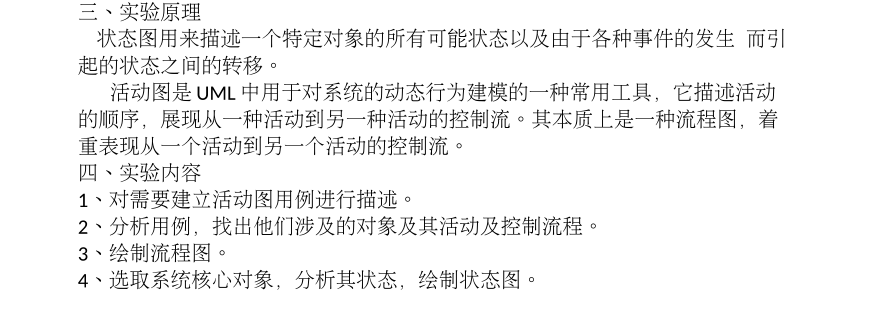
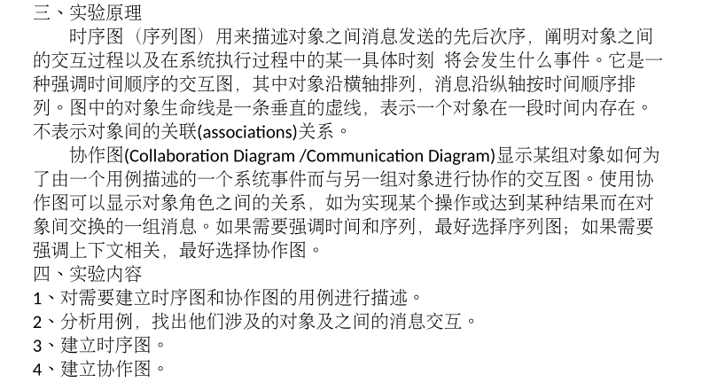

# 图书馆选座系统

## 1、业务建模 

#### （1）问题域分析

* 用户需求可以包括预约座位、选择座位、取消预约等。需要了解用户的需求特点和行为模式，以确保系统具有良好的用户体验和可用性。
* 座位管理座位管理是图书馆选座系统的核心，它需要考虑座位的类型、数量、位置、预约时间、占用时间等因素。座位管理还需要处理座位预约冲突、座位取消、座位释放等操作。
* 预约管理预约管理是指如何管理用户的预约信息，包括预约座位的时间、座位的状态、预约者的身份信息等。预约管理还需要处理预约冲突、预约取消、预约统计等问题。
* 安全管理安全管理是指如何确保图书馆选座系统的数据安全、用户隐私安全和系统安全。需要考虑如何防止数据泄露、攻击、恶意软件等问题，保障用户的信息安全。
* 系统运维管理系统运维管理是指如何对图书馆选座系统进行维护、升级和优化。需要考虑系统的稳定性、性能优化、故障排除等问题，保证系统能够长期稳定运行。

#### （2）用例分析

>  根据系统的职责范围和需求确定参与者：用户、普通管理员、系统管理员、选座系统。

* 用户：用户需要在图书馆内学习或工作，需要使用系统预约座位。用户需要时刻关注座位的使用情况，以便选择适合自己的座位：
  * 浏览座位信息：用户需要查看座位的状态、位置、预约时间等信息，以便选择适合自己的座位。
  *  预约座位：用户需要选择座位区域、时间等进行预约。
  * 现场签到：用户按时到达需要进行扫码签到。
  * 取消预约：用户可以取消已预约的座位。
  * 评价座位：用户可以对座位进行评价，以帮助其他用户选择更合适的座位。
* 普通管理员：普通管理员对座位信息和用户信息进行管理：
  * 浏览用户信息
  * 管理座位预约情况
  * 修改用户信息
  * 添加用户信息
  * 管理图书馆信息

* 系统管理员：维护选座系统，保证系统的正常运行，保护用户的隐私安全：
  * 维护系统的安全
  * 更改管理员权限

#### （3）具体业务分析

1. 用户管理：系统需要支持用户注册和登录功能，用户可以通过注册功能注册一个账户，并使用该账户登录到系统中。
2. 座位预约：系统应该提供座位预约功能，用户可以在系统中选择想要预约的座位和预约时间，系统会对用户的预约信息进行验证，如果验证通过，则预约成功。
3. 座位管理：系统应该提供座位管理功能，包括座位状态的管理和座位信息的管理。管理员可以通过该功能来管理座位状态，例如释放已经过期的座位，以及管理座位的基本信息，例如座位的编号、所在位置、容纳人数等等。
4. 个人中心：系统应该提供个人中心功能，用户可以通过该功能查看自己的预约记录、修改个人信息以及取消预约等操作。
5. 普通管理员管理：系统应该提供管理员管理功能，管理员可以通过该功能添加、修改用户账户，以及管理图书馆的信息和设置等。
6. 系统管理员管理：该管理员拥有系统的最高权限，能够对系统中所有数据进行增删改查操作，同时该管理员需要时刻维护系统的安全性和并发性以避免系统崩溃和用户的信息泄露。

#### （4）UML图形工具建模

## 2、系统分析功能建模

> 从问题描述，本系统数据源是用户、普通管理员、系统管理员，用户提供选座情
> 况、预约情况以及对该次选座进行评价，普通管理员提供对用户的信息，并对其
> 进行管理；进行一步分析问题陈述，我们还可以发现，该系统应该还需要进行一
> 个日志记录记录用户的违约情况，以及用户信息的更改的记录。接着，该系统的
> 数据终点就是普通管理员进行接受查看违约用户的违约信息。系统的主要功能是
> 处理大部分违约情况，并产生日志，同时对于每多次违约的用户记录做一次统计
> 表生成；

> 考虑是否需要加一个时钟，定时记录用户签到情况，如果签到时间已到，用户未
> 签到，系统会发送一个提示信息给用户，提示用户该签到了。 

## 3、系统分析数据建模

## 4、系统分析用例建模

## 5、系统分析对象建模

## 6、系统分析动态建模

## 7、系统行为对象建模

