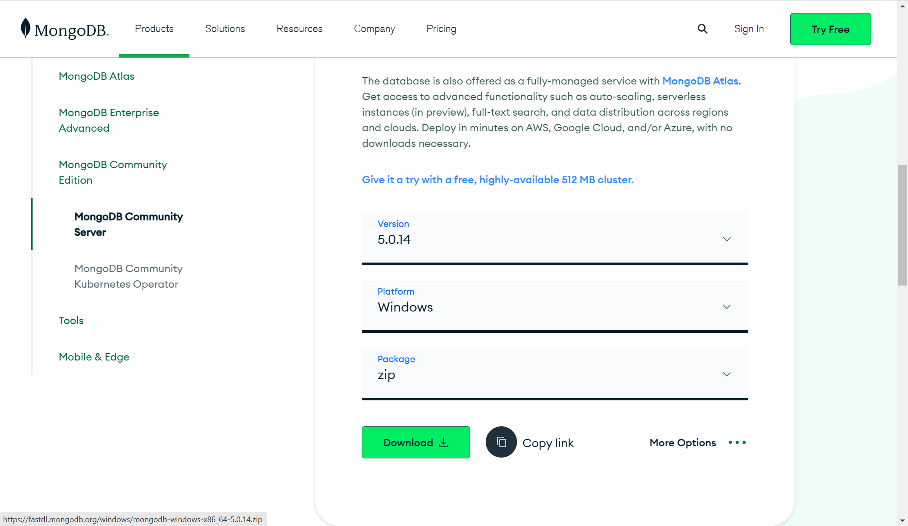
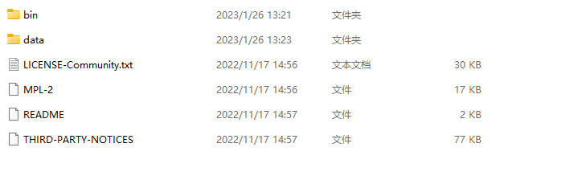
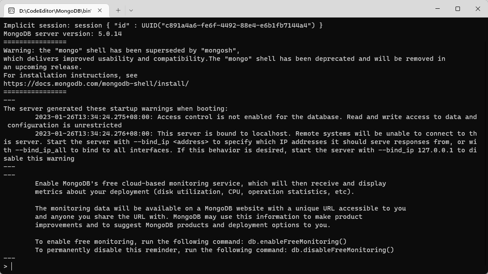

# 1、下载mongodb

[MongoDB官网地址](https://www.mongodb.com/try/download/community)


> 版本按需选择,windows下免安装选择zip格式




# 2、直接解压缩到自己的安装目录



**data目录为自己所创，用来存放mongodb的数据。其他为解压后的完整目录**


# 3、启动MongoDB服务端

进入bin目录，在此目录下打开cmd，输入第一行命令设置`mongodb`数据的存储路径

```bash
mongod --dbpath=../data/db
```

接着打开`mongo`客户端，直接双击`mongo.exe`可执行文件




# 4、安装MongoDB可视化工具Studio 3T（Robo 3T）

> [下载地址](https://studio3t.com/download/)

下载后直接安装，没有什么特别的操作
